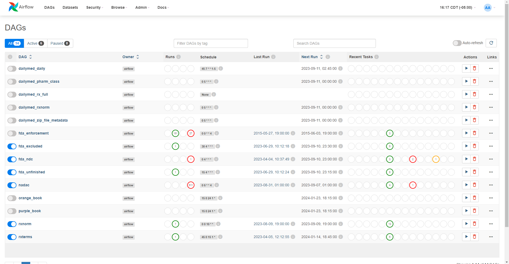

# 🌿 SageRx

SageRx is a medication ontology and medication-related data aggregator created from many different public sources of data.

Including data from DailyMed, FDA, RxNorm, Orange Book, and more!

SageRx uses Airflow to schedule jobs to extract, load, and transform (using dbt) open drug data.

Data ends up in a PostgreSQL database and can be queried using pgAdmin (included with SageRx) or via any SQL editor of your choice.

## Additional Documentation

We will be moving documentation over to Github, but additional documentation exists on the [SageRx Website](https://coderx.io/sagerx).

Subscribe to our [newsletter](https://coderxio.substack.com/) to keep ontop of updates.

## License

## Contributing

We would love to see you contribute to SageRx. Join our [Slack](https://join.slack.com/t/coderx/shared_invite/zt-5b8e9kr4-PsKAVe4crGmECQyyxDIJgQ) channel to get involved.

[Style Guide](docs/style_guide.md): How we think about the structure and naming conventions of SageRx.

## Development Quickstart

### Prerequisites

- Install [Docker](https://docs.docker.com/desktop/).
  - Windows users will also install WSL 2 (a Linux subsystem that runs on Windows) as part of this process.

### Installation

1. Clone the repo.
2. Add a `.env` file at the root of the repo.
3. Add ENV vars to the `.env` file.
   - `AIRFLOW_UID=<uid>` - UID can be found by running `id -u` on linux systems, typically the first user on the system is `1000` or `1001`.
     - Windows users following the Docker Desktop install guide should have WSL 2 installed. You can open up command line, type `wsl` and then within WSL 2, you can enter `id -u` to see your UID.
   - `UMLS_API=<umls_api_key>` - if you want to use RxNorm, you need an API key from [UMLS](https://uts.nlm.nih.gov/uts/signup-login).
4. Make sure Docker is installed
5. Run `docker-compose up airflow-init`.
6. Run `docker-compose up`. 

> NOTE: if you have an [M1 Mac](https://stackoverflow.com/questions/62807717/how-can-i-solve-postgresql-scram-authentication-problem) `export DOCKER_DEFAULT_PLATFORM=linux/amd64`, and re-build your images

> NOTE 2: if you're running [WSL1/2](https://learn.microsoft.com/en-us/windows/wsl/about) you may need to use `docker compose` rather than `docker-compose` per [this](https://stackoverflow.com/questions/66514436/difference-between-docker-compose-and-docker-compose/66526176#66526176)

### Server URLs

- Airflow UI is hosted on `localhost:8001` or `0.0.0.0:8001`
  - Username/password = `airflow` / `airflow`
- PgAdmin is hosted on `localhost:8002` or `0.0.0.0:8002`
  - Username/password = `sagerx` / `sagerx`

### Using dbt

On `docker-compose up` a dbt container will be created to be used for cli commands. To enter commands run `docker exec -it dbt /bin/bash`. This will place you into a bash session in the dbt container. Then you can run dbt commands as you normally would.

To serve dbt documentation locally, enter the commands in the dbt container `dbt docs generate` then `dbt docs serve  --port 8081`. They should generate on `http://localhost:8081`

### Integrating with AWS

The export_marts DAG is implemented to allow users to push .csv versions of the marts-layer tables to an AWS S3 bucket of their choosing. The DAG is currently configured to export 2 tables from the sagerx_dev schema: all_ndc_descriptions and atc_codes_to_rxnorm_products. Future iterations may allow for more schemas/tables as demand dictates. If a user wishes to get .csv copies of those tables pushed to an AWS S3 bucket, they will need to add an additional 3 variables to their .env file (continuing from the Installation instructions):

- ACCESS_KEY = 'your-aws-access-key-id'
- SECRET_ACCESS_KEY = 'your-aws-secret-access-key-id'
- DEST_BUCKET = 'the-name-of-your-aws-bucket'

The access and secret-access keys can be found in 2 ways:
1. If the user has the AWS CLI tools installed, simply type from Mac/Linux command prompt OR Windows Powershell:
  - cat ~/.aws/credentials
2. If the user does not have AWS CLI tool installed or is unfamiliar with such, it is possible you would have saved your credentials in a location on your local machine - the file will be named after the IAM User in your AWS account, something like 'username_accessKeys.csv'. If you can't find that file, simply create a new set by following this procedure:
  - Log in to the AWS console
  - Search 'IAM' in the search bar and select the IAM Service --> the IAM Dashboard is displayed
  - In the 'IAM resources' box, click on the number beneath 'Users' --> all IAM users are displayed
  - choose the user with permissions in accordance with your needs (this will typically be the user with administrator access, but the only IAM User permission that is required is Read/Write permissions on your S3 bucket)
  - Within the user page, click on 'Security Credentials', and scroll down to the box titled 'Access Keys'
    - NOTE: A single user can only have 2 valid sets of login credentials at any one time. If you already have 2, you will need to either delete one or create a new user for this application
    - NOTE: Once you have created a set of credentials, you only have 1 opportunity to view/save those credentials from the AWS UI. you should therefore be sure to save the .csv file in safe place.
  - Click 'Create access key', select the 'Command Line Interface' option, click Next, fill in a name for the keys, click 'Create access keys', then download the .csv file and save it in safe place
  - Open the .csv file, then paste the access key and secret access key into the .env file as described above

### Troubleshooting

If you get issues on folder permissions:

`sudo chmod -R 777 postgres,data,extracts,logs,plugins`

If you get trouble from the postgres container with errors such as `password authentication failed for user "airflow"` or `role "airflow" does not exist`, these are all from the same issue that postgres is not setting itself up correctly. This is because of a file permission issue solved by running `chmod +x ./postgres/0_pg_stat_statement.sh`. You might need to remove any existing database configuration with `rm -rf airflow/data` and `docker-compose down --volumes`.
